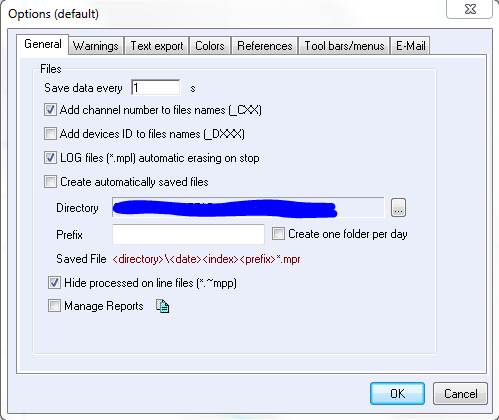

# EC-Lab and BT-Lab Email Notification System
[](https://github.com/CabanaLab/ElectrochemNotification/releases)

This python script is designed to run headless on a Windows machine running EC-Lab or BT-Lab software from Bio-logic. It watches for `.mpl` (log) files to be deleted by the programme and uses information in the file name to send an email to the owner of the experiment that their experiment is complete.

## Project Architecture and Examples

This system is designed to work with a specific data architecture. For example:

```
.
└── Data
    ├── Alvin
    │   ├── SampleA1
    │   │   ├── Test1.mpr
    │   │   ├── Test2.mpr
    │   │   ├── Test3.mpl	#This is the log file
    │   │   └── Test3.mpr
    │   └── SampleA2
    │       └── Test1.mpr
    ├── Simon
    │   └── Sample-S1
    │       └── Test1.mpr
    └── Theodore
        └── Sample-T1
            └── Test1.mpr
```

Each user (Alvin, Simon and Theodore) have their own separate data folder with their data inside. Once Alvins Test3 finishes, bio-logic software deletes the .mpl file (see below for more info). Once the file is deleted, DirectoryWatcher.py takes the filename as a string, in this case `./Data/Alvin/SampleA1/Test3.mpl`.

<!-- It then tries to match parts of the string (case sensitive) to an entry in the `user_info.txt` (This file should be created and edited by the user upon installation. The format is `id_string	email_address` and is tab delimited.) -->

<!-- **user_info.txt** -->

<!-- ``` -->
<!-- Alvin	alvin@chip.edu -->
<!-- Simon	simon@chip.edu -->
<!-- Theodore	theodore@chip.edu -->
<!-- ``` -->

<!-- In this case, `Alvin` is contained in the string `./Data/Alvin/SampleA1/Test3.mpl`, so an email notification would be sent to `alvin@chip.edu`. -->

## Installation

Clone this git repo to a location of your choice, install the requirements, and create the `user_info.txt` file.
```bash
git clone git@github.com:CabanaLab/ElectrochemNotification.git
cd ./ElectrochemNotification
pip install -r requirements.txt
touch ./EmailWhenDone/user_info.py
touch ./EmailWhenDone/localsettings.py
```

**user_info.py**
*This file must be created on your local machine prior to startup*
```python

```

**localsettings.py**
*This file must be created on your local machine prior to startup*
```python
#localsettings

## Moderator Information
moderator = ''							#Your moderators name
moderator_email = ''					#Moderators email address (for error reporting)

## Email Client Information
server_email = ''						#the email address you wish to send notifications from (works with gmail)
username = ''							#email username
password = ''							#email password

ignore_list = []                        #list of strings contained in filenames you wish to ignore.
``` 

## Running the client headless

On a windows machine, the script can be run headless from the command line using:
```bash
pythonw DirectoryWatcher.py /directory/to/Data
```

## Running tests
```bash
cd ./EmailWhenDone
python3 -m unittest tests/tests.py
```
Running tests from another directory results in failure

## Does my installation of BT-Lab/EC-Lab delete .mpl files when the experiment is complete?
You can check whether your version of EC-Lab or BT-Lab is deleting .mpl files by going to Tools > Options > General tab and checking `LOG files (*.mpl) automatic erasing on stop`



